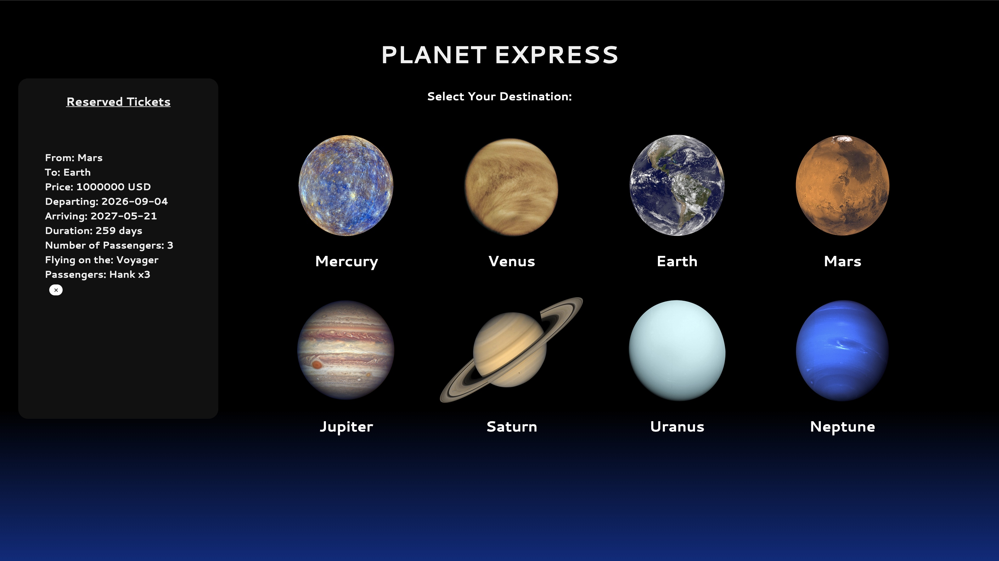

# Planet Express

#### Web App providing tickets to the solar system with realistic orbital transfer windows and travel times.

## Technologies

### Front End:
- Built with Vanilla JavaScript and CSS

### Back End *[(link)](https://github.com/valentinem1/Planet-Express-API)*:
- Ruby
- Rails
- PostgreSQL
- Active Model Serializers

## Installation

- Open PostgreSQL
- Run command: 
`bundle && rails db:create && rails db:migrate && rails s`

## Demo

[Video](https://www.youtube.com/watch?v=Kogxr-Shwss)

